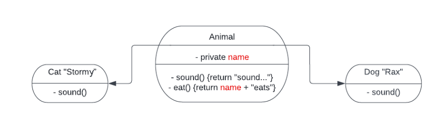

# [project: Animals Part 1. OOP basics](http://syllabus.africacode.net/projects/oop/animals/part1/)

### Project structure: JavaScript

```
├── src
|   └── animals.js
└── package.json
```

<strong>Note:</strong> You will be asked to create a number of classes. Make sure you export them using the following syntax:

```
module.exports = {class1Name, class2Name, ...}
```


<strong>Note:</strong> Your ``package.json`` should be valid. If it is a blank file then your project will not be marked as competent. If you are not sure what a valid package.json should look like, then look it up!

## Instructions
In this challenge, you will create 3 classes.

1. Super class called Animal
2. Dog and Cat class both extend Animal class (a dog is an animal, and a cat is an animal).
3. Dog and Cat class should only have one function, which is their own implementation of the sound() function. This is polymorphism.




```
// JavaScript

let dog1 = new Dog();
let dog2 = new Dog("Simba")

dog1.eat();   // returns 'Rax eats'
dog1.sound(); // returns 'Bark'

dog2.eat()   // returns 'Simba eats'
dog2.sound() // returns 'Bark'

let cat1 = new Cat();
let cat2 = new Cat("Smokey")

cat1.eat();   // returns 'Stormy eats'
cat1.sound(); // returns 'Meow'

cat2.eat()    // returns 'Smokey eats'
cat2.sound()  // returns 'Meow'
```


4. Now let’s add composition. Make a new class called ``Home``. Lots of people have dogs and cats in their homes. ``Home`` should have a function called ``adopt pet`` that takes any ``Animal`` as an input and returns the number of pets that have been adopted thus far. The new pet should be stored in the ``Home`` object in an array/list. The ``Home`` object should also have a function called ``make all sounds``. It should work like this:

```
// JavaScript

let home = new Home();
let dog1 = new Dog();
let dog2 = new Dog();
let cat = new Cat();


home.makeAllSounds();// this returns an empty array
home.adoptPet(dog1); // 1
home.makeAllSounds();
// this returns:
// ["Bark"]

home.adoptPet(cat); // 2
home.makeAllSounds();
// this returns:
// ["Bark", "Meow"]

home.adoptPet(dog2); // 3
home.makeAllSounds();
// this returns:
// ["Bark", "Meow", "Bark"]
```

Add some functionality to ``adopt pet`` so that an error/exception, gets raised/thrown if you try to adopt the same pet twice. Make sure that the error has a useful message!

For example,

```
home.adoptPet(dog1) // returns the number of pets that have been adopted thus far
home.adoptPet(dog1) // an error/exception gets raised
```

## Check your understanding
Consider the following OOP concepts. Can you see and explain how they are demonstrated in this project?

1. Encapsulation
2. Inheritance
3. Polymorphism
4. Composition

## Instructions for reviewer

- The Animal class should follow the document’s diagram’s instructions exactly.
- A constructor that accepts a string to set the name for the constructed pet should exist.
- The ``makeAllSounds`` method should return an array of the exact strings specified in the instructions. e.g “Bark”, “Meow”
- All the class methods should return the exact strings defined and not print them.
- A house cannot adopt a specific instance of a pet more than once.
- Make sure any error messages are descriptive.


<br /><br />

# [project: Animals Part 2. Adding Tests](http://syllabus.africacode.net/projects/oop/animals/part2/)

In this project you’ll be testing some of your previous work.

## Project structure: JavaScript

Your directory structure should look like this:

```
├── spec
|   ├── support
|   |   └── jasmine.json
|   └── ???
├── src
|   └── animals.js
└── package.json
```

## Test the existing functionality
Add tests to your project. Make sure you test every method in every class.

Please make sure you test absolutely every function that you wrote in part 1. Make sure that the different functions do what they are meant to do in all different situations.

Take a bit of time to find out about a concept called “test coverage”. We want 100% coverage in this project.

## Instructions for reviewers

Make sure that there are no redundant tests. For example if there is a test that checks that a dog says “Bark” then it is very pointless to check that the dog does not say “Meow”, “caterpillar” or “whatzit”, because we already know that it says “Bark”.

<br />
<br />

# [project: Animals Part 3. Adding more functionality](http://syllabus.africacode.net/projects/oop/animals/part3/)

In this project you’ll be revising some of your earlier work and you’ll be adding more functionality.

## Remove pet function
Add a function called ``remove pet`` on the ``Home`` class. This function should take any Animal as an argument. ``remove pet`` should return the number of pets in the home as an integer.

If you try to remove a pet that has not been adopted then an error/exception with a suitable error message should be raised/thrown.

## Dogs can’t have more than one Home, but Cats can
Extend the ``adopt pet`` function so that it raises/throws an Exception/Error if a home tries to adopt a dog that already has a home.

If multiple homes try to adopt the same cat then that is fine.

Here is some pseudocode:

```
home1.adoptPet(dog)  # ok
home2.adoptPet(dog) # this is not allowed since the dog already lives in home1

home1.adoptPet(cat)
home2.adoptPet(cat)
home3.adoptPet(cat) # this cat has 3 homes. That's a lucky cat
```

## Testing

Make sure you test all your functionality thoroughly